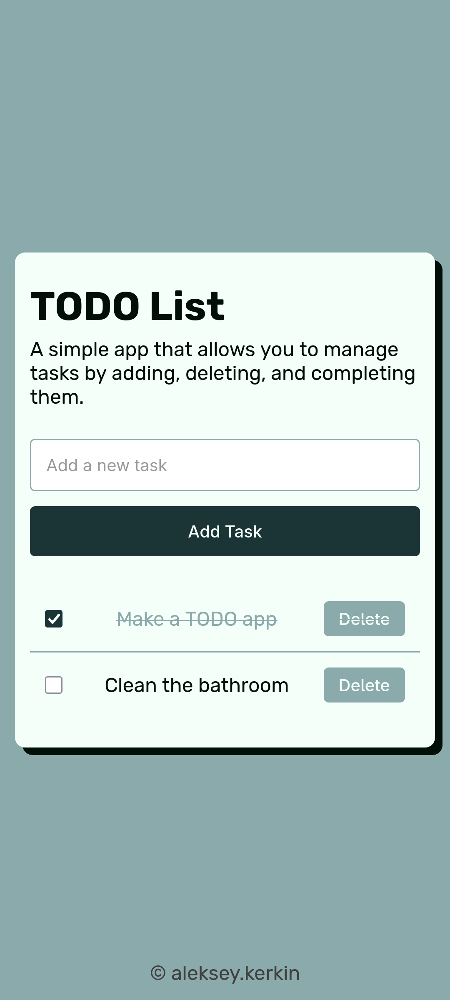
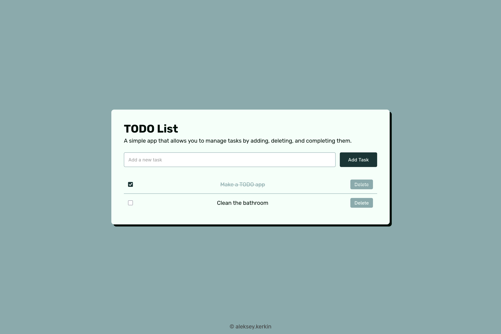

# TODO App

A TODO app is a simple application that allows users to manage tasks by adding, deleting, and marking them as complete. It typically features a user-friendly interface where users can view their tasks and interact with them easily.

## Table of contents

- [Overview](#overview)
  - [Screenshot](#screenshot)
  - [Links](#links)
- [Built with](#built-with)

## Overview

### Screenshot

|               Mobile                |                Desktop                |
| :---------------------------------: | :-----------------------------------: |
|  |  |

### Links

- Live Site URL: [GitHub Pages](https://aleksey-kerkin.github.io/todo-app/)

## Built with

- HTML5
- SCSS
- JavaScript
- BEM
